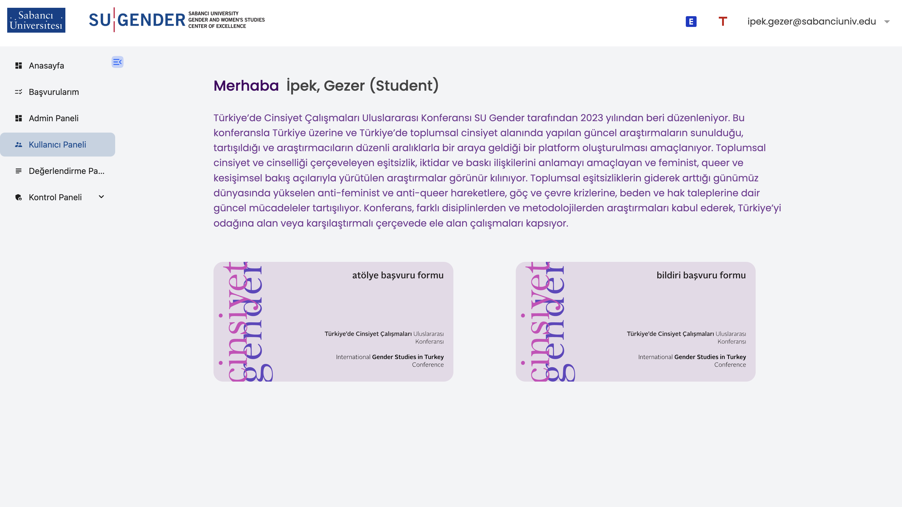
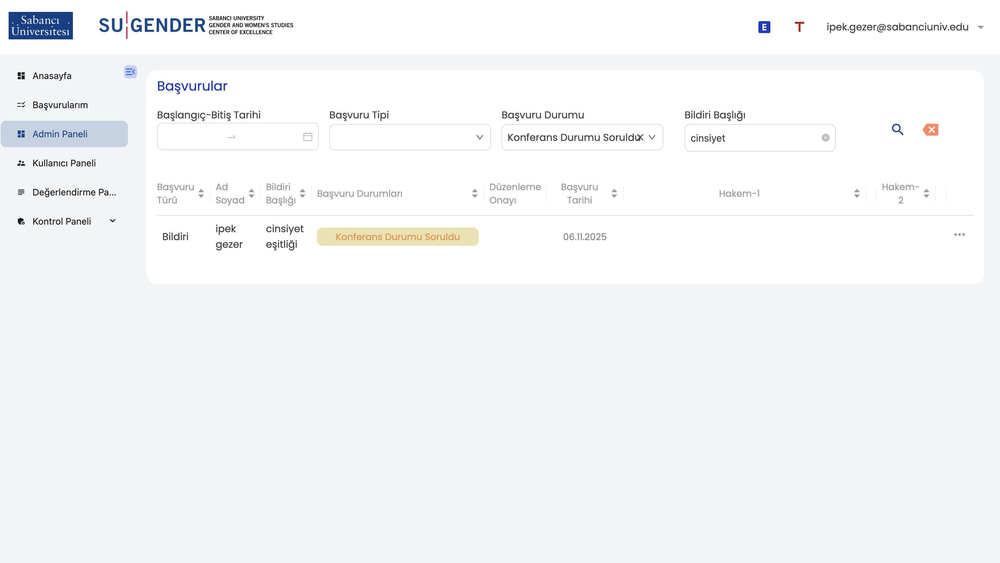
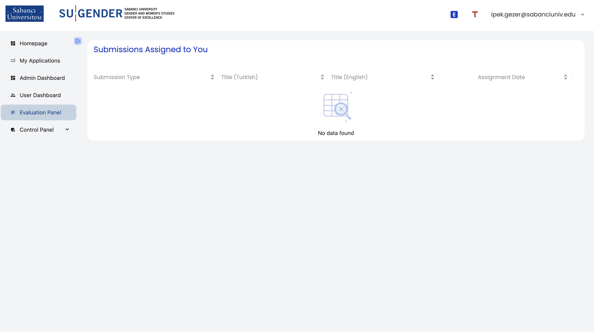

# SUGENDER Conference Application Website

We developed a multi-page conference website for **SUGENDER** using **Kuika**, a low-code platform that allowed rapid prototyping and efficient development without extensive technical overhead.

Throughout the process, we designed and structured **25+ pages**, focusing on clear navigation, responsive layout, and a user-friendly experience.

Below are a few example previews from the application:
> Note: The application includes both Turkish and English pages.  
> Screenshots reflect this structure and therefore contain content in both languages.

